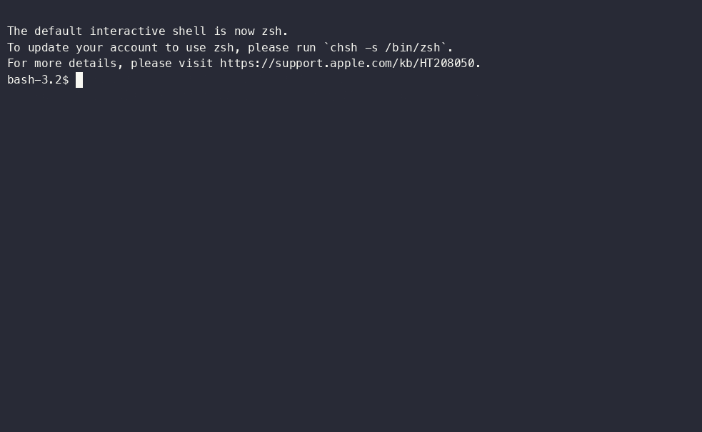
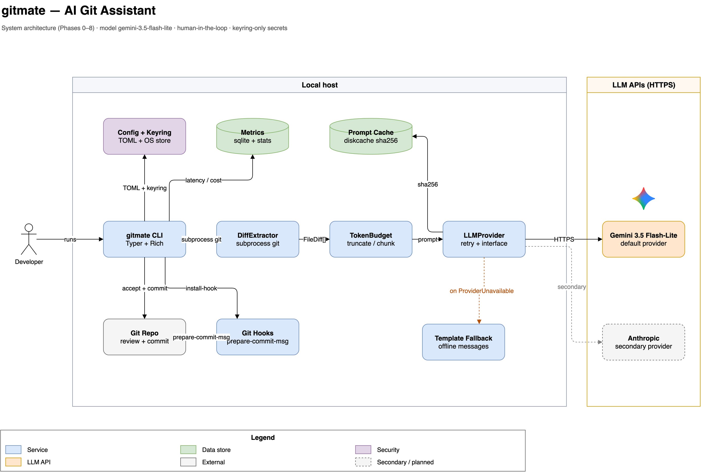

# gitmate

AI-assisted git commit messages, PR summaries, and changelogs — with caching,
cost control, and a human always in the loop before anything is committed.

[](https://github.com/getdownandcode/gitmate/actions/workflows/ci.yml)

[](LICENSE)



## Why gitmate

- **A human reviews everything.** `gitmate commit` shows the message and asks
  before anything is committed — accept, edit, regenerate, or cancel.
  Non-interactive mode exists but is strictly opt-in.
- **It still works when the API doesn't.** Offline, rate-limited, or keyless?
  gitmate degrades to deterministic, template-based messages with a visible
  warning — never a stack trace in your face, never a silent quality drop.
- **Costs are tracked, not guessed.** Responses are cached by content hash,
  diffs over the model's context window are truncated or chunked, and every
  invocation logs tokens, latency, and estimated spend to a local SQLite
  database you can inspect with `gitmate stats`.

## Install

```bash
# uv (recommended)
uv tool install gitmate-cli

# pipx
pipx install gitmate-cli

# plain pip
pip install gitmate-cli
```

The command is `gitmate` (the distribution name is `gitmate-cli`).
Requires Python 3.11+.

Then store your Gemini API key — it goes into your OS keychain, never a file:

```bash
gitmate config set-key
```

## Quickstart

```bash
git add -p                          # stage something
gitmate commit                      # generate → review → accept
```

That's the whole loop. The generated message appears in your terminal with
`[a]ccept / [e]dit / [r]egenerate / [c]ancel` — you choose what lands.

## Commands

```bash
gitmate commit                      # message for the staged diff (interactive)
gitmate pr-summary --base main      # PR description vs base branch, to clipboard
gitmate changelog --from v1.0.0 --to v1.1.0   # grouped release notes
gitmate stats                       # usage, cache hits, spend, latency
gitmate debug-diff                  # cleaned/filtered staged diff (debugging aid)
```

Configuration lives in `~/.config/gitmate/config.toml` (auto-created):

```bash
gitmate config show                 # current settings (never the key)
gitmate config set model gemini-3.5-flash-lite
gitmate config set commit_style conventional   # or 'plain'
gitmate config set ignore_globs '*.gen.py,*.tmp'
gitmate config set max_context_tokens 8000     # override the model's window
gitmate config set cache_dir /path/to/cache    # prompt-cache location
gitmate config set free_tier true              # zero-cost accounting
```

### Automatic commit messages via git hooks

For a personal checkout:

```bash
gitmate install-hook
```

This installs a `prepare-commit-msg` hook: Git opens your editor with the
generated message already in it, so you review inside your normal
`git commit` flow. The hook is crash-safe — four-second generation budget,
atomic message writes, and it never blocks a commit: on failure or timeout
it leaves Git's own message untouched and exits 0. Re-running `install-hook`
upgrades a gitmate-managed hook in place; foreign hooks are never overwritten.
`gitmate uninstall-hook` removes it.

For teams on the [pre-commit](https://pre-commit.com) framework:

```yaml
repos:
  - repo: https://github.com/getdownandcode/gitmate
    rev: <gitmate-version>
    hooks:
      - id: gitmate-prepare-commit-msg
```

## Architecture



Full-resolution diagram and editable sources (draw.io): see
[`docs/`](docs/) — architecture, class, use-case, and sequence diagrams.

## Real metrics (from `gitmate stats`)

These are gitmate's own numbers from this project's development period
(~1 week of real usage while building Phases 0–8; ~61% of runs hit the
template fallback because the keychain often had no API key during automated
runs — shown exactly as recorded, not cleaned up):

| Command | Runs | Cache hit rate | Tokens | Est. spend | Avg latency |
|---|---:|---:|---:|---:|---:|
| `changelog` | 94 | 0.0% | 7,750 | $0.0057 | 1 ms |
| `commit` | 64 | 0.0% | 0 | $0.0000 | 2 ms |
| `commit-hook` | 5 | 0.0% | 0 | $0.0000 | 0 ms |
| `pr_summary` | 114 | 0.0% | 3,520 | $0.0030 | 0 ms |

**Total: 277 invocations, 11,270 tokens, $0.0087 estimated spend.**
Two weeks of daily-use data will replace this table at the next release.

## The caching tradeoff

gitmate uses **hash-based caching** (`sha256(template_version + model +
prompt)` → response) rather than semantic caching. Semantic caching needs a
vector store, an embedding-model call on every lookup, and a similarity
threshold you'll forever be tuning. Hash caching is O(1), free, and correct;
its only cost is a ~0% hit rate on a diff that changed by one line — an
acceptable, explainable tradeoff for v1. Because the key includes a
`template_version`, changing a prompt template deliberately invalidates old
entries instead of mixing generations. Semantic caching gets revisited only
if the metrics above ever show the hit rate matters.

## Design decisions

**Graceful degradation comes first.** The most interesting engineering in a
CLI that calls an LLM is not the happy path — it's every other path. gitmate
treats API failure as a normal input: typed `ProviderUnavailable` after
bounded retries, a deterministic template fallback that derives a usable
message from diff metadata (no LLM call at all), and a visible warning so
nobody mistakes a degraded message for a generated one.

**A human is in the loop by default, not as a feature.** Nothing auto-commits
without explicit confirmation. The `--yes` escape hatch is opt-in precisely
because the easiest way to break trust with a tool that writes to your
repository is to make one decision the user didn't approve.

**`subprocess` over GitPython.** Exact control over diff flags (`--staged`,
three-dot ranges, `-M`, `-z`) with zero abstraction leakage — and the parser
is hardened against the real-world mess git emits (spaces, quotes, backslashes,
non-ASCII filenames, and ambient config like `diff.mnemonicPrefix` that
silently breaks naive parsers).

**One provider protocol, proven once.** `LLMProvider` is a three-line
protocol; Gemini (`google-genai`) is the default, Anthropic slots in behind
the same boundary. The abstraction earned its keep by staying small.

**Plans lose to data.** Phase 2 originally truncated "low-signal" files
(test snapshots first) per the roadmap. In practice that actively harmed
test-focused commits — where the tests *are* the story. It was reverted to
size-only ordering, deliberately, with the reasoning recorded in the code.

**Tests run against real git.** The suite never mocks the git binary —
scratch repositories in `tmp_path` with real commits. Only the `LLMProvider`
boundary is faked, because that's where our code ends and a vendor's begins.
297 tests, `mypy --strict` clean, `ruff` clean.

## Development

```bash
git clone https://github.com/getdownandcode/gitmate.git
cd gitmate
uv sync --extra dev
uv run pytest
```

## License

Apache-2.0 — see [LICENSE](LICENSE).
